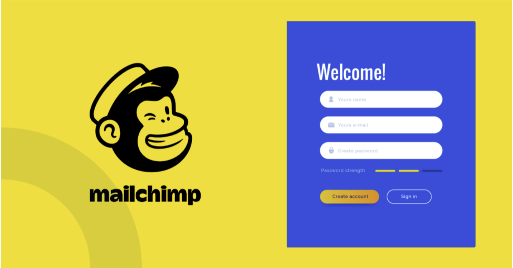

# minority-Backend 



<!-- The Github-page Link of the hosted front-end app **[HERE]()** -->

# API Endpoints included

### User

- **POST /api/v1/user/register:** Create an account
- **POST api/v1/user/login:** Log into your account
- **PATCH api/v1/user/secure-password:** secure account with password
- **PATCH api/v1/user/:id:** change account info


# Installation and Environment Setup

**Clone the repository from [Github](https://github.com/pextech/minority-backend.git).**

( You will need **Git** for this if you are running a Windows PC, Get it [HERE](https://git-scm.com/) )

```git clone https://github.com/pextech/minority-backend.git```

**To Install all dependencies:**

```npm install```

**Now to start the app:**

```npm run start```

**To start the app in development mode:**

( You need **nodemon** installed for this, run `npm i -g nodemon` to install it )

```npm run start:dev```

# Tools used

- Server-Side Framework: **Node/Express**
- Testing framework: **Mocha/Chai**
- database: **MongoDB**

# More Tools

- ES6 Transpiler: **[Babel](babeljs.io)**
- Deployment: **[Heroku](https://www.heroku.com)**

# Author 

` Pextech 😎🇷🇼 `